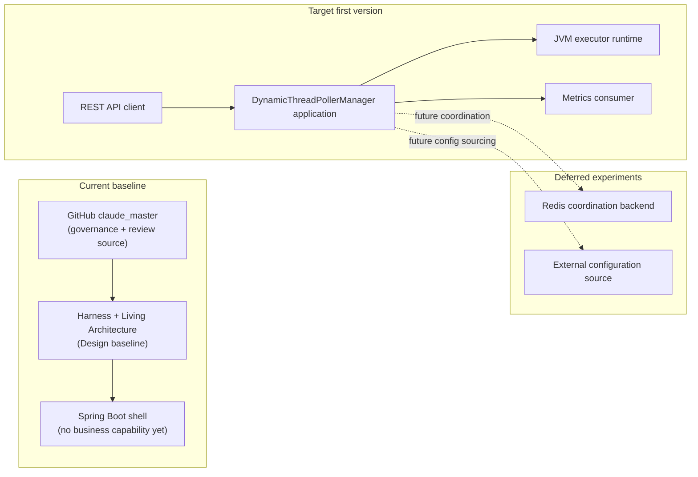

# System Context and Quality Attributes

## 1. System Objective

DynamicThreadPollerManager is a benchmark-oriented Spring Boot system under design for managing dynamic thread-pool and scheduling experiments. The architecture baseline defines the target system model and quality goals before any implementation change is approved.

## 2. Context and Actors

| Actor / External Element | Role | Current or Future |
|---|---|---|
| Operator / Developer | Triggers experiments, queries status, and modifies configuration | Target V1 consideration |
| REST API Client | Accesses management and experiment interfaces | Target V1 consideration |
| DynamicThreadPollerManager Application | Experimental system subject | Current shell / target system |
| JVM Executor Runtime | Hosts actual thread-pool and scheduling behavior | Target capability |
| Metrics Consumer | Reads experiment metrics | Future / V1 decision |
| Redis Coordination Backend | Supplies multi-node coordination candidate capability | Deferred |
| External Configuration Source | Candidate configuration input source | Deferred |

## 3. Current Baseline vs Target Architecture

Current baseline means the repository has toolchain, governance assets, and a Spring Boot shell. Target architecture means the project can host managed executors, scheduling reconfiguration, observability, and later coordination experiments. The baseline is not the target; it is the starting shell.

## 4. Deployment Evolution

The likely evolution path is single-node in-memory baseline first, then observable runtime experiments, then scheduling recovery experiments, then deferred coordination or persistence only if a later change approves them.

## 5. Quality Attribute Scenarios

| Quality Attribute | Stimulus | Expected Response | Future Verification |
|---|---|---|---|
| Modifiability | A runtime parameter or scheduling rule changes | The change can be introduced within a bounded capability change without rewriting unrelated layers | Design review and change-scoped tests |
| Testability | A concurrency edge case is introduced | The architecture admits deterministic tests with controlled time and synchronization | Unit and slice tests with timeouts |
| Observability | An executor or task state changes | The system surfaces state through queries, metrics, or records | Assertions against snapshots and metrics |
| Safety of runtime reconfiguration | A configuration update is invalid | The update fails explicitly and does not leave the runtime in an illegal state | Negative-path tests and validation evidence |
| Scope traceability | A change is proposed | The affected capability and architectural boundary are identifiable | Approved change artifacts and review trail |
| Experimental reproducibility | A workload or failure injection is repeated | The same inputs produce an inspectable result window | Repeatable experiment scripts and recorded outcomes |

## 6. Architecture Constraints

- Do not treat the current shell as the finished target architecture.
- Do not require Redis, Kafka, or database as default first-version components.
- Do not force Web, validation, or metrics implementation before the unified design decides on the first version envelope.
- Keep the architecture honest about what is future capability versus what is current baseline.

## 7. Open Questions for V1 Unified Design

- Which runtime capabilities belong in the first version envelope?
- Which transport, validation, and observability components are required in V1?
- Which experiment outputs must be exposed for benchmark evidence?
- Which deferred capabilities remain explicitly out of scope for V1?
