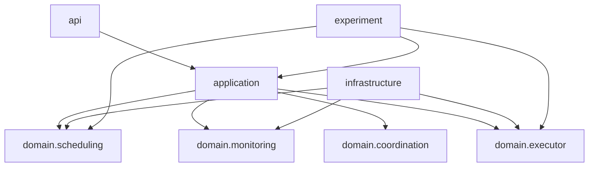

# Logical Architecture and Package Boundaries

## 1. Target Logical Components

| Component | Responsibility |
|---|---|
| API Adapter | REST contracts, DTO mapping, validation error exposure |
| Application Services | Command/query orchestration |
| Executor Domain | Managed executor definition, validation, runtime state semantics |
| Scheduling Domain | Schedule definition, versioning, rebuild semantics |
| Monitoring Domain / Ports | State snapshot, execution record, metric event abstractions |
| Coordination Port | Future single-execution lease contract |
| Infrastructure Adapters | JDK executor, metrics, future Redis implementation |
| Experiment Workloads | Controlled load and failure scenarios |

## 2. Dependency Rules

- `api -> application -> domain`
- `infrastructure -> domain`
- `experiment -> application/domain ports as approved by change design`

## 3. Candidate Java Package Map

Using the current root package `com.zhiwu.dynamicthreadpollermanager`, the candidate package map is:

- `com.zhiwu.dynamicthreadpollermanager.api`
- `com.zhiwu.dynamicthreadpollermanager.application`
- `com.zhiwu.dynamicthreadpollermanager.domain.executor`
- `com.zhiwu.dynamicthreadpollermanager.domain.scheduling`
- `com.zhiwu.dynamicthreadpollermanager.domain.monitoring`
- `com.zhiwu.dynamicthreadpollermanager.domain.coordination`
- `com.zhiwu.dynamicthreadpollermanager.infrastructure`
- `com.zhiwu.dynamicthreadpollermanager.experiment`

These packages are design targets only. V1 unified design decides which packages are introduced in its first implementation slice. No empty directories or classes should be created just to match the map.

## 4. Component Responsibilities

- API adapters translate external requests into application commands and responses.
- Application services orchestrate use cases and preserve the boundary between transport and domain.
- Domain modules hold invariants and state semantics.
- Infrastructure modules provide concrete runtime adapters only after a change approves them.
- Experiment workloads simulate conditions for observation and verification.

## 5. Cross-Cutting Concerns

Cross-cutting concerns include validation, error mapping, observability, timing control, and change-scoped experiment evidence. They should be explicit, not hidden in one-off controller logic.

## 6. Packaging Decisions Deferred to V1 Design

- Which of the candidate packages appear in the first implementation slice.
- Whether monitoring and coordination ports need separate top-level package families immediately.
- Whether experiment workloads live beside tests or under a dedicated module path.
- How the first version balances compactness against explicit modular boundaries.
