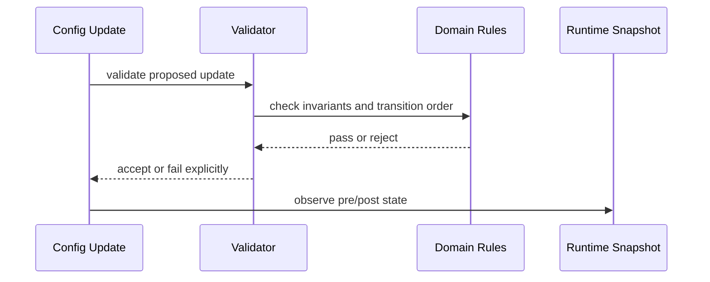

# Managed Executor Domain Model

## 1. Design Problem

The target problem is to model an executor that can be registered, queried, validated, and updated at runtime without losing correctness or hiding illegal state transitions.

## 2. Domain Concepts

| Concept | Responsibility |
|---|---|
| `ManagedExecutorId` | Stable identifier for a managed executor |
| `ExecutorDefinition` | Desired configuration and metadata |
| `ExecutorRuntimeSnapshot` | Actual runtime state reading model |
| `ExecutorConfigUpdate` | Runtime change command |
| `ManagedExecutorRegistry` | Registration, lookup, and query of managed executors |
| `ExecutorConfigValidator` | Validation of configuration conversion invariants |
| `TaskRejectionObservation` | Observable expression of rejection behavior |

## 3. Configuration Model

| Configuration Area | Candidate Initial Support | Deferred / Requires Design |
|---|---|---|
| `corePoolSize` | Candidate for V1 | Update API and validation rules must be defined |
| `maximumPoolSize` | Candidate for V1 | Legal transition order must be defined |
| `keepAliveTime` | Candidate for V1 | Unit and effect semantics must be defined |
| `allowCoreThreadTimeOut` | Deferred until V1 decision | Not presupposed |
| queue capacity replacement | Not default first-version scope | Must be designed separately |
| rejection policy runtime replacement | Deferred until V1 decision | Risk and observability must be defined |

## 4. Runtime Snapshot Model

A runtime snapshot should capture the current effective executor state needed to explain what the system is doing now, not just what it was configured to do. The snapshot should support comparisons before and after an update.

## 5. Configuration Update Semantics

Runtime updates should be applied through a controlled transition process that avoids illegal intermediate executor state. Updates should be explicit operations, not silent mutations.

## 6. Invariants and Validation Rules

- `corePoolSize >= 0`
- `maximumPoolSize > 0`
- `maximumPoolSize >= corePoolSize`
- runtime application order must avoid illegal JDK executor intermediate states
- invalid changes must fail explicitly
- pre-update and post-update state must be verifiable
- queue replacement is not included by default just because the project is about dynamic threads

## 7. Failure and Rejection Semantics

Failures must be observable. Illegal updates, rejected transitions, and runtime inconsistencies should be modeled as explicit domain outcomes rather than ignored conditions.

## 8. Candidate Use Cases

- Register a managed executor with a validated definition.
- Query an executor runtime snapshot.
- Apply a bounded configuration update.
- Reject an illegal update and report why.

## 9. Deferred Decisions

- Whether the first version exposes the executor through REST, CLI, or both.
- Whether rejection policy replacement is in the first version.
- Whether metrics are read from a domain port or infrastructure adapter in the first version.
