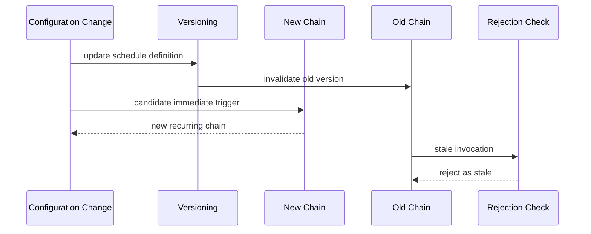

# Scheduling Reconfiguration and Recovery Model

## 1. Problem Statement

The scheduling domain must model how periodic work changes over time without allowing stale scheduling chains to continue producing valid work after a configuration update.

## 2. Target Concepts

| Concept | Purpose |
|---|---|
| `ManagedScheduledTaskId` | Identifies a manageable periodic task |
| `ScheduleDefinition` | Desired cadence, toggle, and trigger rules |
| `ScheduleVersion` | Prevents stale task chains from remaining active |
| `TaskExecutionRecord` | Captures execution start, end, success/failure, and exception summary |
| `StallDetectionPolicy` | Defines how long without healthy execution counts as stalled |
| `ScheduleRebuildDecision` | Result of whether to rebuild the scheduling chain |
| `ExecutionCoordinationPort` | Future distributed unique execution abstraction |

## 3. Desired Reconfiguration Semantics

```text
When a periodic configuration changes, the target semantics are:
1. the old schedule chain becomes invalid;
2. the updated task may trigger immediately once;
3. subsequent runs follow the new cadence;
4. any late invocation from the old version must not produce valid business execution;
5. if a task misses expected execution for too long, the system should be able to detect and evaluate rebuild.
```

These semantics are target design input and pending V1 inclusion decision, not current implementation.

## 4. Stale Schedule Prevention

Versioning is the primary idea for preventing stale chains from remaining effective. A late-running old version should be detectable and rejected against the current version.

## 5. Stall Detection and Recovery

The domain should allow a policy to determine when a task is not healthy, when to detect staleness, and when a rebuild decision is justified.

## 6. Single-Node vs Distributed Semantics

Single-node behavior is the current target baseline. Distributed coordination is deferred and should not be implied by the presence of schedule versioning alone.



## 7. Candidate Scenarios for V1 Planning

- Change the periodic cadence.
- Trigger an immediate run after update.
- Reject stale late invocation.
- Detect a missing or stalled execution and produce a rebuild decision.

## 8. Deferred Decisions

- Whether V1 includes immediate trigger semantics or only version invalidation.
- Whether rebuild is automatic or merely recommended in the first version.
- Whether distributed coordination appears in V1 or stays deferred.
