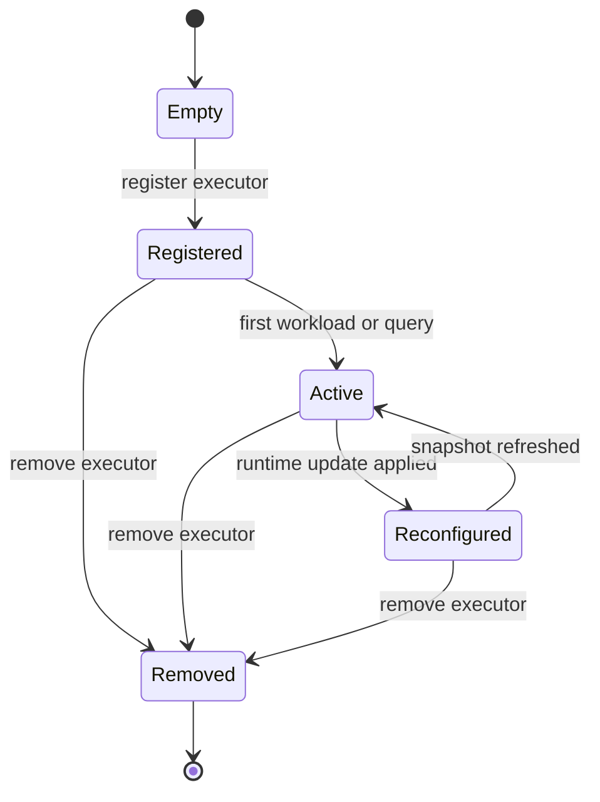
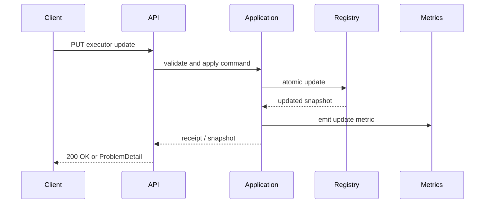

# V1 Domain Capability Design

## 1. Core Domain Objects

| Object | Responsibility |
|---|---|
| `ManagedExecutorId` | Stable identifier for a registered executor. |
| `ManagedExecutorDefinition` | Immutable description of the allowed runtime configuration. |
| `ManagedExecutorSnapshot` | Read model for the current executor state and version. |
| `ManagedExecutorRuntimeState` | Runtime view of active tasks, queue pressure, and applied settings. |
| `ExecutorRuntimeUpdateCommand` | Change request for allowed executor parameters. |
| `WorkloadScenario` | Named, repeatable workload profile used for experiments. |
| `WorkloadExecutionResult` | Outcome summary for a controlled workload run. |
| `ExecutorChangeReceipt` | Evidence object that records what changed and when. |

## 2. Command and Query Model

### Commands

- register executor,
- update executor runtime settings,
- remove executor from the registry,
- trigger a workload run,
- reset a workload scenario for repeatable experiments.

### Queries

- list registered executors,
- fetch one executor snapshot,
- list workload scenarios,
- fetch latest workload result,
- inspect current metrics summary.

## 3. Update Semantics

Executor updates are applied atomically against a single registry entry:

1. validate the request against the allowed parameter set,
2. verify the target executor exists,
3. check internal invariants such as `corePoolSize <= maxPoolSize`,
4. apply the update to the live executor adapter,
5. increment the snapshot version,
6. emit a change receipt and updated metrics.

Rejected updates must leave the previous snapshot intact.

## 4. Registry Lifecycle

## 5. Workload Interaction

Controlled workloads are small, deterministic task sets that are designed to:

- occupy executor threads,
- exercise queue pressure,
- surface before/after differences when runtime settings change,
- complete within bounded test timeouts.

The workload API must not depend on long sleeps or nondeterministic timing.

## 6. Concurrency Invariants

- a single executor update is atomic from the registry viewpoint,
- snapshots are immutable once published,
- concurrent read operations must observe a consistent snapshot,
- rejected configuration changes must not mutate the live executor,
- workload execution should not break registry consistency,
- no distributed coordination assumptions are allowed in V1.

## 7. Errors and Validation

| Error | When It Happens |
|---|---|
| `ExecutorNotFound` | The client references an unknown executor id. |
| `InvalidExecutorConfiguration` | A runtime update violates a validation rule or invariant. |
| `WorkloadScenarioNotFound` | The client references an unknown workload scenario. |
| `WorkloadExecutionRejected` | The requested workload cannot run under the current runtime state. |
| `ConcurrentUpdateConflict` | An update races with another update and cannot be applied safely. |

## 8. Package and Class Candidates

- `api.executor`
- `api.workload`
- `application.executor`
- `application.workload`
- `domain.executor`
- `domain.workload`
- `infrastructure.executor`
- `infrastructure.metrics`
- `support.error`

## 9. Design to Test Mapping

| Design Rule | Expected Test Evidence |
|---|---|
| Atomic update semantics | A successful update changes the snapshot once and only once. |
| Invalid input rejection | A malformed or incompatible request returns a stable error response. |
| Snapshot consistency | Concurrent reads observe the last committed version. |
| Workload repeatability | The same scenario produces comparable behavior across runs. |
| No scheduling capability in V1 | No scheduling-reconfiguration tests exist in the V1 slice. |

## 10. Mermaid Sequence

